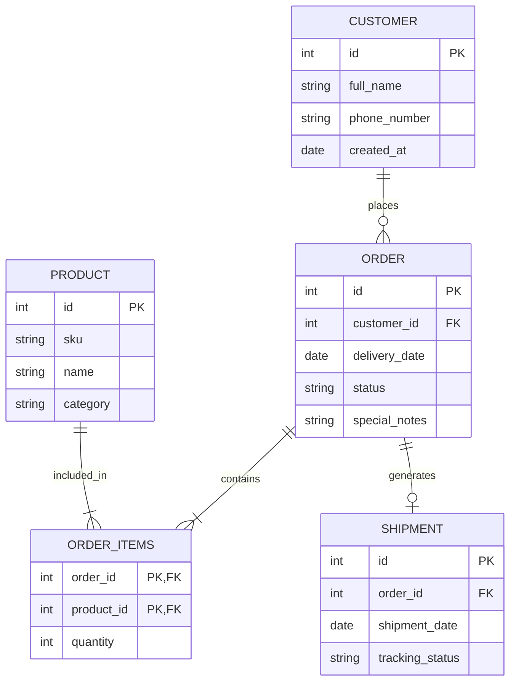

## Brand & Style

This design system is built for mission-critical operational environments where clarity, speed of recognition, and reduced eye strain are paramount. The brand personality is **utilitarian, precise, and authoritative**. It targets logistics coordinators and floor managers who need to process dense information at a glance.

The visual style is **Corporate / Modern** with a focus on high-contrast dark mode. It utilizes a deep charcoal foundation to provide a sophisticated backdrop for vibrant status indicators. The aesthetic avoids unnecessary decoration, opting for clear structural hierarchy and functional surfaces that prioritize data readability over flourish.

## Colors

The palette is optimized for a **Dark Mode** first experience. The core foundation uses a deep charcoal (`#121212`) to eliminate glare in low-light or indoor industrial settings. 

- **Primary Blue:** Refined for dark mode to ensure a 4.5:1 contrast ratio against dark surfaces, used primarily for active states and primary calls to action.
- **Status Colors:** These are the functional drivers of the UI. Orange (`#F59E0B`) signifies "Pending" or "In-Progress" states, while Green (`#10B981`) indicates "Ready" or "Delivered."
- **Surfaces:** We use a tiered monochromatic scale for depth. Elevated containers use `#1E1E1E`, while interactive elements like input fields use `#2D2D2D` to stand out against the background.

## Typography

The typography system relies exclusively on **Inter** to maintain a systematic and utilitarian feel. 

- **Scale:** The scale is compact to accommodate dense data tables and complex forms.
- **Contrast:** On dark backgrounds, use pure white (`#FFFFFF`) for primary headlines and a "High Emphasis" grey (`#E5E7EB`) for body text. 
- **Hierarchy:** Labels for form fields use `label-md` with medium weight to ensure they are distinct from the user's input text.
- **Mobile:** For mobile views, `headline-lg` should scale down to `20px` to prevent text wrapping in header areas.

## Layout & Spacing

The design system utilizes a **12-column fluid grid** for desktop and a **4-column grid** for mobile. 

- **Grid Logic:** Content is contained within cards that span the width of the grid. Data tables should stretch to fill the available horizontal space.
- **Spacing Rhythm:** We use a 4px base unit. 16px (`md`) is the standard padding for containers, while 8px (`sm`) is used for internal element grouping (e.g., label to input).
- **Density:** To maintain an "operational" feel, vertical spacing is kept tight. Table rows should aim for a 48px minimum height to balance density with touch/click targets.

## Elevation & Depth

In this dark-themed system, depth is communicated through **Tonal Layers** rather than heavy shadows.

- **Level 0 (Base):** Background color `#121212`.
- **Level 1 (Cards/Containers):** Surface color `#1E1E1E` with a subtle 1px border (`#333333`).
- **Level 2 (Interactive/Inputs):** Surface color `#2D2D2D`.
- **Shadows:** Use shadows sparingly. When necessary (e.g., for modals or floating menus), use a deep, sharp shadow: `0px 4px 12px rgba(0, 0, 0, 0.5)`.
- **Dividers:** Use low-contrast dashed or solid lines (`#333333`) to separate logical sections within a single surface.

## Shapes

Following the "ROUND_FOUR" specification, the design system uses a **Rounded** shape language (`0.5rem` / `8px` base).

- **Standard Components:** Buttons, Input fields, and Cards all share the 8px corner radius.
- **Large Components:** Sections or main layout containers use `rounded-lg` (16px).
- **Small Components:** Tags and chips use a more pronounced rounding to differentiate them from buttons, often approaching pill-shapes for status indicators.

## Components

- **Buttons:**
    - *Primary:* Filled with "OrderFlow Blue" (`#3B82F6`), white text. 
    - *Secondary/Ghost:* Bordered with `#333333`, light grey text.
    - *Success/Action:* High-contrast white background with dark text for "Save" or "Submit" actions.
- **Status Chips:** Low-opacity backgrounds of the status color (e.g., 20% Alpha) with high-intensity text in the same hue. This ensures the status is visible without being overwhelming.
- **Input Fields:** Background `#2D2D2D`, 1px border `#333333`. Placeholder text in `#6B7280`. Focused state should use a 2px "OrderFlow Blue" border.
- **Data Tables:**
    - Headers: `#1E1E1E` background with `label-sm` uppercase text.
    - Rows: Alternating zebra stripes are not required; use 1px horizontal dividers instead.
    - Highlighting: Active or selected rows should use a subtle blue tint or a left-edge blue accent bar.
- **Cards:** Group related information (e.g., Customer Details, Order Items) into cards with clear `headline-sm` titles and horizontal dividers.

## Database Schema & Relationships

### Entity-Relationship Diagram (ERD)

### קשרים בין ישויות

| ישות A | סוג הקשר | ישות B | הסבר | טבלת חיבור (Junction Table) |
| :--- | :--- | :--- | :--- | :--- |
| Customer | One-to-Many | Order | מטייל (לקוח) אחד יכול לבצע מספר רב של הזמנות לאורך זמן, אך כל הזמנה שייכת ללקוח אחד ספציפי בלבד. | — |
| Order | Many-to-Many | Product | הזמנה אחת יכולה להכיל מספר פריטי ציוד שונים (למשל אוהל ושק שינה), ואותו סוג פריט יכול להופיע במספר רב של הזמנות נפרדות. | Order_Items |
| Order | One-to-One | Shipment | כל הזמנה שמוכנה להפצה מקושרת לתעודת משלוח אחת ספציפית המכילה את פרטי האספקה הסופיים. | — |

### מטריצת פעולות מסד נתונים (CRUD)

| ישות | Create — מה נוצר? | Read — מה מוצג? | Update — מה ניתן לערוך? | Delete — מה ניתן למחוק? |
| :--- | :--- | :--- | :--- | :--- |
| Order | מנהל הלוגיסטיקה מזין טופס ויוצר רשומת הזמנה חדשה. | צפייה בטבלת ההזמנות (Order Database) או בלוח הבקרה (Dashboard). | שינוי סטטוס ההזמנה (למשל מ-In Treatment ל-Ready), עדכון פריטים או זמני אספקה. | ביטול הזמנה (לרוב מיושם כ"מחיקה רכה" על ידי עדכון הסטטוס ל-Canceled), או מחיקת רשומה שגויה. |
| Customer | נוצר לקוח חדש בעת שמירת הזמנה ראשונה עבור מטייל שלא קיים במערכת. | קריאת פרטי ההתקשרות של הלקוח והצגת היסטוריית ההזמנות שלו בעמוד Customers. | עדכון טלפון או תיקון שגיאות כתיב בשם הלקוח. | הסרת הלקוח ממסד הנתונים (נדיר, יתבצע בעיקר לבקשת הלקוח). |
| Product | הוספת פריט ציוד מחנאות חדש (כמו דגם חדש של פנס או נעלי הרים) לקטלוג החנות. | קריאת מק"ט (SKU) ושם הפריט כחלק מפירוט ההזמנה או בקטלוג המוצרים. | עדכון שם המוצר, סיווג קטגוריה או תיאור טכני. | מחיקת מוצר שכבר אינו נמכר בחנות או הסרתו מהמלאי הפעיל. |
